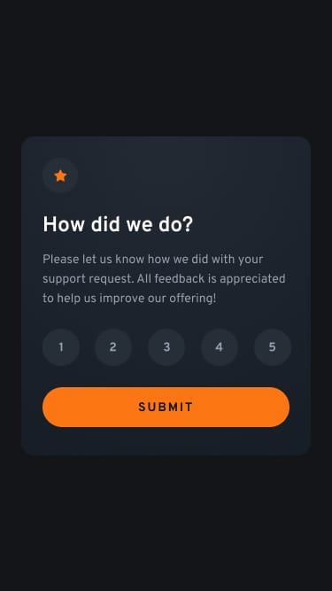

# Frontend Mentor - Interactive rating component

This is a solution to the [Interactive rating component challenge on Frontend Mentor](https://www.frontendmentor.io/challenges/interactive-rating-component-koxpeBUmI).

## Table of contents

- [Overview](#overview)
  - [Screenshot](#screenshot)
  - [Links](#links)
- [My process](#my-process)
  - [Built with](#built-with)
  - [What I learned](#what-i-learned)
  - [Continued development](#continued-development)
- [Author](#author)

---

## Overview

### Screenshot

|  |  |
| :--: | :--: |
| Desktop | Mobile |

### Links

- Solution URL: [Frontend Mentor](https://www.frontendmentor.io/solutions/interactive-rating-component-oae45tUd7R)
- Live Site URL: [GitHub Pages](https://rahulpaul127.github.io/interactive-rating-component/)

---

## My process

### Built with

- Semantic HTML5 markup
- CSS custom properties
- CSS Flexbox
- Mobile-first responsive workflow
- Vanilla JavaScript for DOM manipulation

### What I learned

- Building a centered, interactive card layout using CSS Flexbox for the main structure and alignment.
- Using `radial-gradient` in CSS to create a subtle, premium dark mode background for the card component.
- Managing active UI states with Vanilla JavaScript, specifically adding and removing an `active` class on the rating buttons to highlight the user's selection.
- Toggling between the "rating" state and the "thank you" state by manipulating a `hidden` CSS class in response to the form submission.
- Implementing edge case handling, such as providing a subtle visual feedback animation (scaling) if the user attempts to submit without selecting a rating first.

### Continued development

- Add the final deployed links after publishing the project.
- Enhance accessibility (a11y) by ensuring full keyboard navigation support across the rating buttons and the submit button, building upon the `aria-label`s currently in use.
- Consider adding page transition animations when switching between the rating and thank you states to make the user experience even smoother.

## Author

- Frontend Mentor - [@rahulpaul127](https://www.frontendmentor.io/profile/rahulpaul127)
- Twitter - [@rahulpaul127](https://x.com/rahulpaul127)
